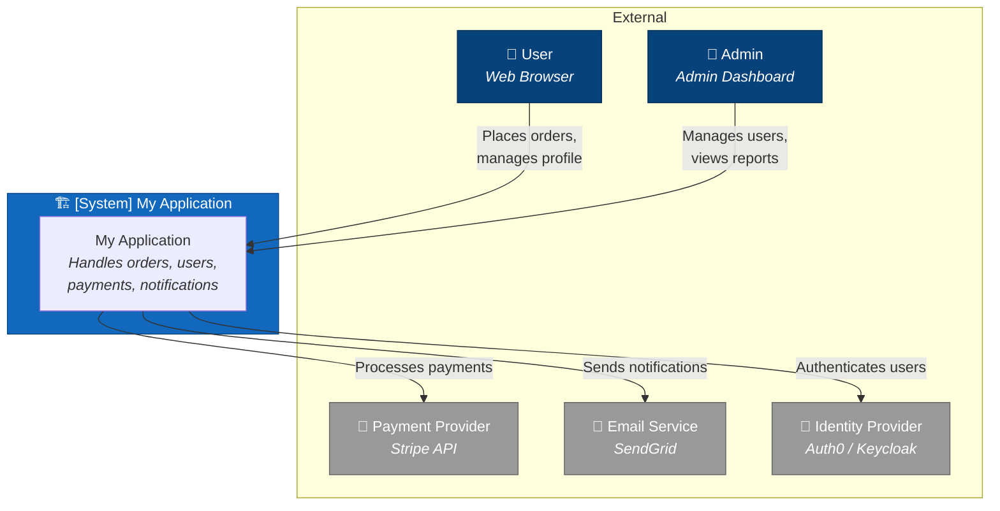
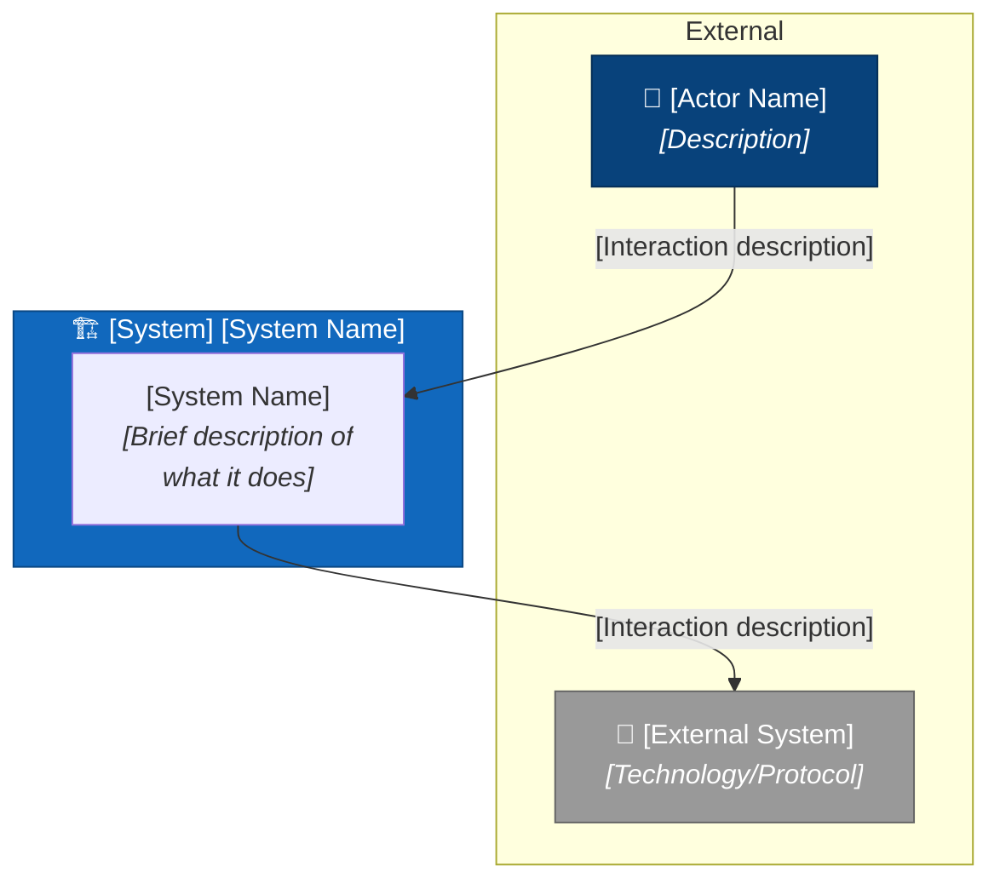
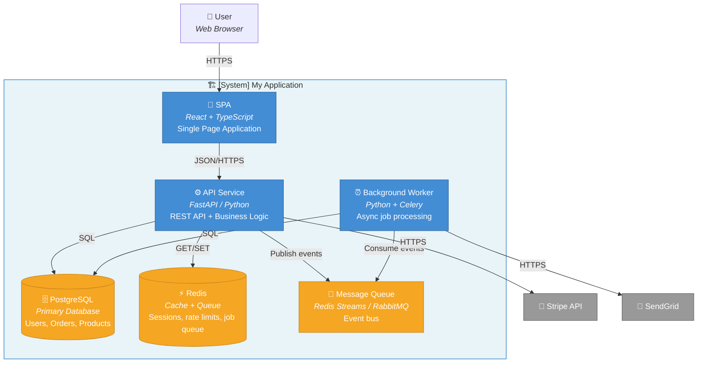
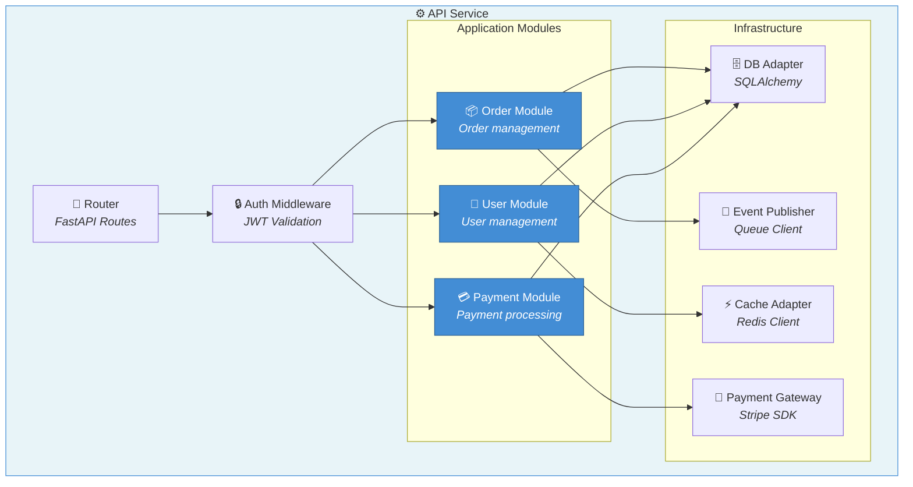
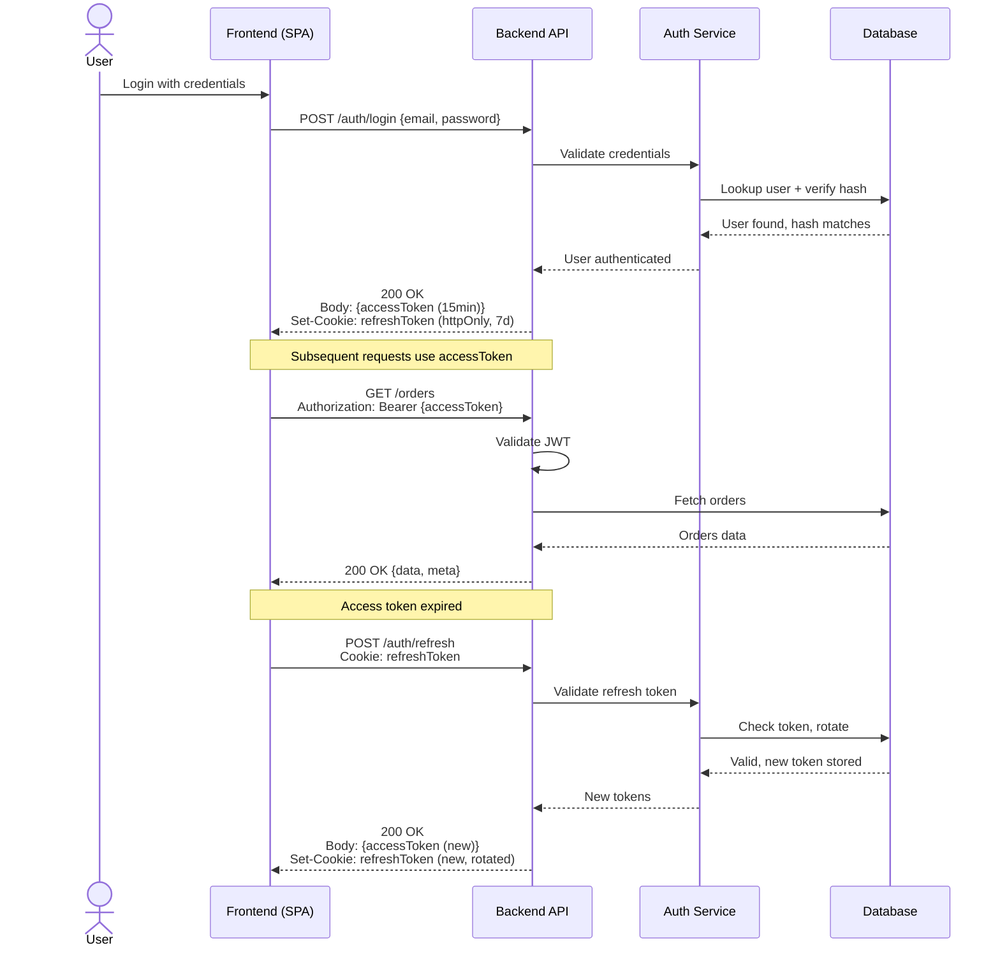
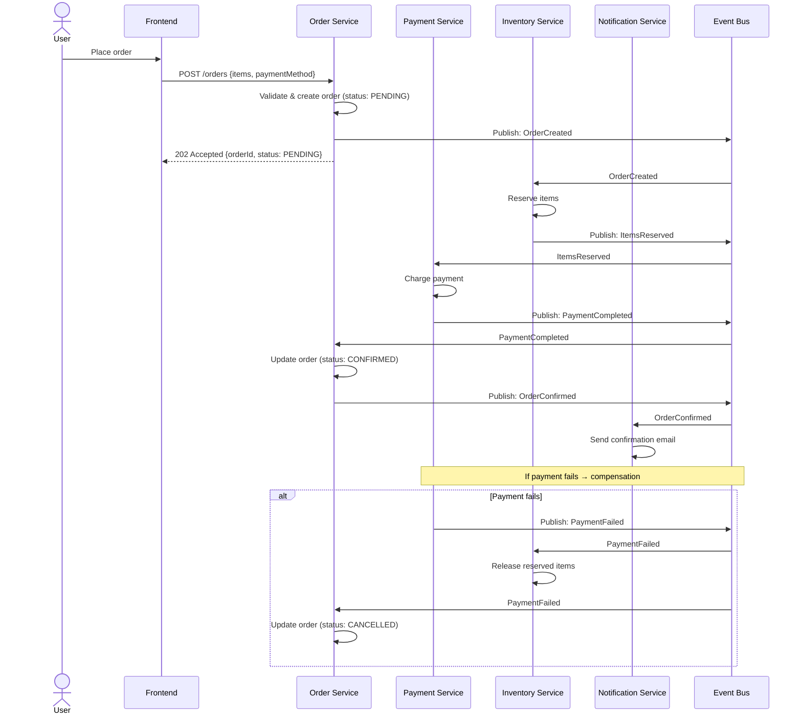
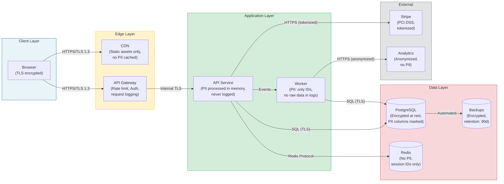
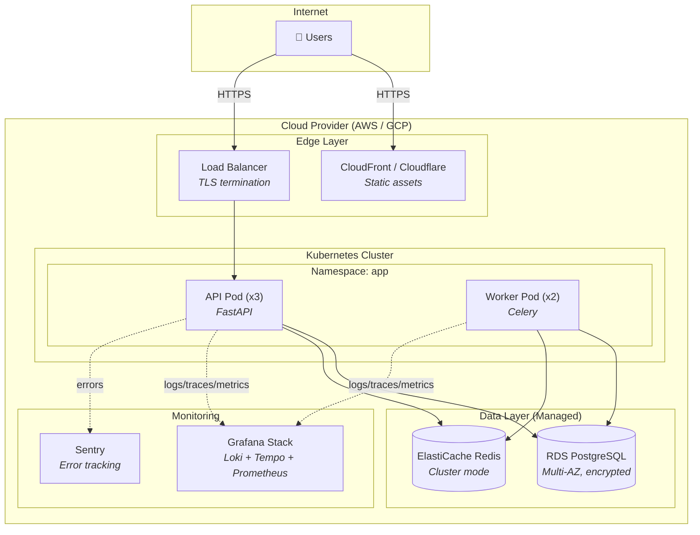
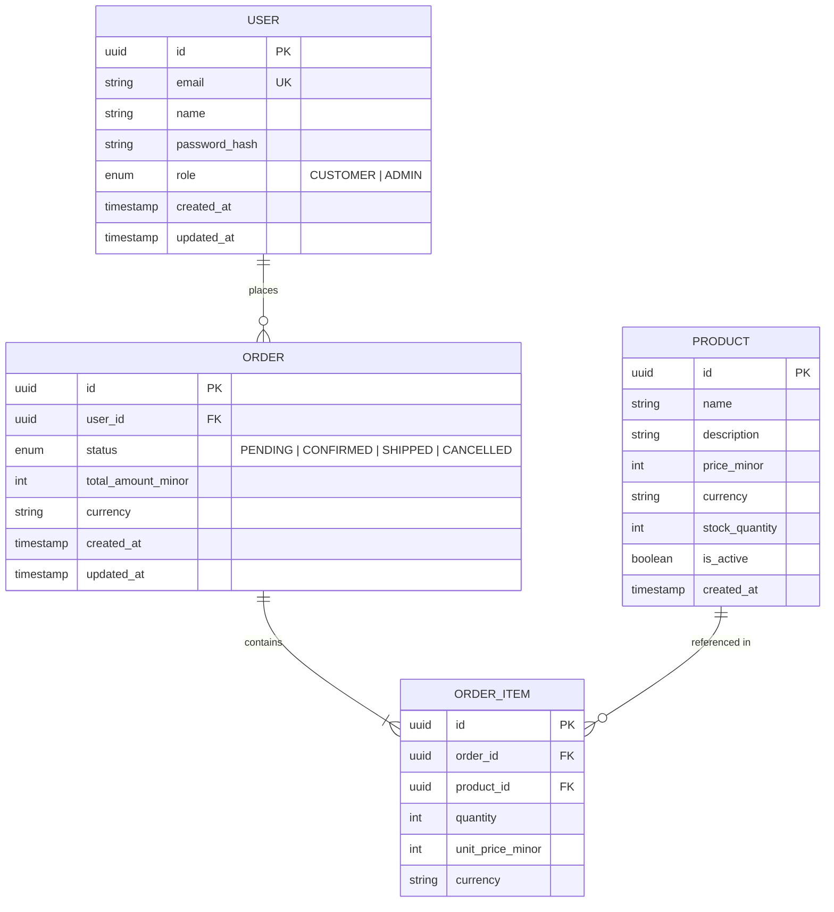
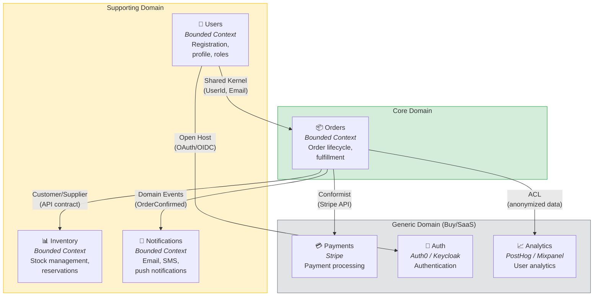

# C4 & Architecture Diagrams Reference

> Mermaid templates for C4 diagrams, sequence diagrams, data flow diagrams, and ER diagrams.
> All diagrams are Markdown-embeddable and renderable in GitHub/GitLab.

---

## 1. C4 Model Overview

The C4 model (Simon Brown) provides four levels of abstraction:

| Level | Name | Shows | When |
|-------|------|-------|------|
| **1** | System Context | System + external actors/systems | Always (every system) |
| **2** | Container | Deployable units (apps, DBs, queues) | Always (every system) |
| **3** | Component | Internal structure of a container | When container internals are complex |
| **4** | Code | Classes / functions | Rarely (for critical modules only) |

**Every diagram must include:** Title, Scope (what's in/out), Legend, Date, Owner.

---

## 2. C4 Level 1 — System Context

Shows the system as a black box with its users and external systems.

**Template (adapt per project):**

---

## 3. C4 Level 2 — Container Diagram

Shows the major deployable units within the system.

---

## 4. C4 Level 3 — Component Diagram

Shows the internal structure of a single container (e.g. the API Service).

---

## 5. Sequence Diagrams

### Auth Flow (JWT + Refresh Token)

### Order Processing (Multi-Service / Saga)

---

## 6. Data Flow Diagram (for sensitive data)

---

## 7. Deployment Diagram

---

## 8. Entity Relationship Diagram (Conceptual)

---

## 9. Bounded Context Map

---

## 10. Diagram Checklist

Before publishing any diagram, verify:

- [ ] **Title** — clearly states what the diagram shows
- [ ] **Scope** — explicitly states what's included and excluded
- [ ] **Legend** — colors / shapes explained (if non-obvious)
- [ ] **Date / Version** — when was this last updated
- [ ] **Owner** — who maintains this diagram
- [ ] **Labels** — all arrows and connections are labeled with the protocol/interaction type
- [ ] **Technology** — each box states the technology (e.g. "FastAPI", "PostgreSQL")
- [ ] **Consistent style** — same colors/shapes for same categories across all diagrams

---

## 11. Mermaid Tips

- Use `graph TB` (top-bottom) for hierarchical diagrams
- Use `graph LR` (left-right) for flow diagrams
- Use `sequenceDiagram` for interaction sequences
- Use `erDiagram` for data models
- Use `subgraph` to group related elements
- Use `style` to color-code categories (blue = your system, gray = external, etc.)
- Use `-->|"label"|` for labeled connections
- Use `-.->` for async / monitoring connections
- Mermaid renders in GitHub, GitLab, Notion, and most Markdown renderers
